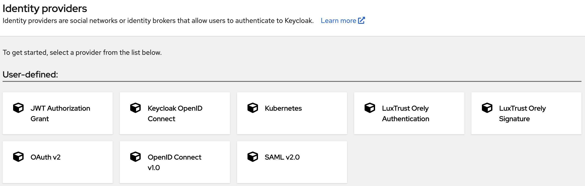
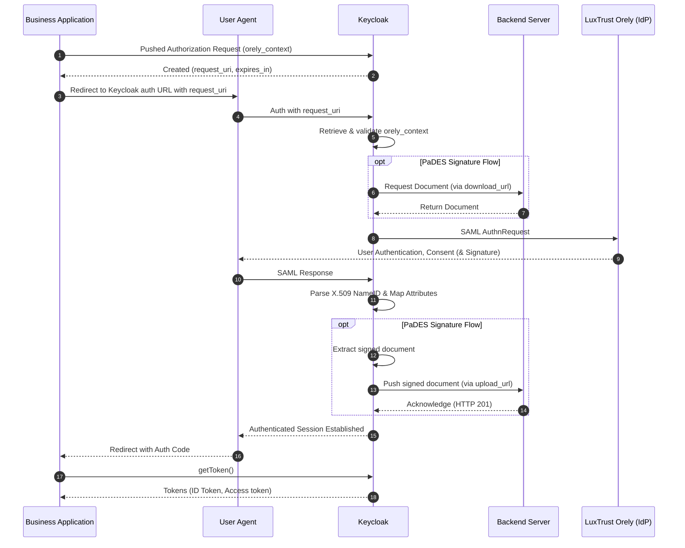

# 🔐 keycloak-orely

[](https://opensource.org/licenses/Apache-2.0)
[](#compatibility)
[](https://makeapullrequest.com)

> **Seamlessly integrate LuxTrust Orely services into your Keycloak ecosystem.**

`keycloak-orely` is a specialized Keycloak extension designed to bridge the gap between Keycloak and the **[LuxTrust Orely portal](https://www.luxtrust.com/)**. By extending the standard Keycloak SAML 2.0 Identity Provider, this plugin automatically handles Orely's specific constraints and requirements out-of-the-box, saving you hours of custom development and debugging.



Whether you are building public services or enterprise applications, this plugin provides a robust, compliant, and native authentication experience for your end-users.

## 🌟 Why use this plugin?

*   **🔌 Plug-and-Play Integration:** Deploy the JAR, and you're ready to go.
*   **🛡️ LuxTrust-Orely Compliant:** Specifically tailored to respect LuxTrust Orely's strict constraints, metadata, and SAML profiles.
*   **✍️ Authentication & e-Signature:** Provides two distinct Identity Providers out-of-the-box: one for standard user authentication and another specifically dedicated to PaDES document signing.
*   **⚙️ 100% UI Configurable:** No hardcoded settings. Manage all your endpoints, certificates, and mappings directly from the Keycloak Admin Console.
*   **⚡ Native Performance:** Built directly on top of Keycloak's core SAML SPI for optimal speed, security, and seamless upgrades.

## 📋 Compatibility

This plugin is designed for Keycloak's Quarkus distribution and has been tested with the following versions:

| Keycloak Version | Plugin Version | Java Version |
| :--- | :--- | :--- |
| `26.7.x` | `1.3.3` | `25+` |

*(Note: Older versions of Keycloak are not supported by this release).*

## 🏗️ Architecture & OIDC PAR Flows

This extension provides two distinct out-of-the-box flows tailored for LuxTrust Orely, both leveraging the **Pushed Authorization Request (PAR - RFC 9126)** pattern. Using PAR is critical to securely transmit context and challenge payloads to Keycloak via the back-channel, preventing front-channel exposure.



## 🚀 Getting Started

Before installing the plugin, ensure you have the required credentials. As an official LuxTrust provider, you must obtain the following elements from LuxTrust:

1.  **Provider ID:** A unique identifier assigned by LuxTrust (syntax: `SPxxxx` where `xxxx` is a number).
2.  **Orely Test Server Certificate:** The test environment certificate provided by LuxTrust (`C=LU, L=Capellen, O=LuxTrust S.A., CN=Orely Server Integration`).
3.  **Orely Production Server Certificate:** The production environment certificate provided by LuxTrust (`C=LU, L=Capellen, O=LuxTrust S.A., CN=Orely Server`).
4.  **Provider Identification Keystore:** A private key and certificate used by LuxTrust to authenticate your SAML requests and encrypt response assertions. 

> ⚠️ **IMPORTANT — Keystore Placement:**
> The `SPxxxx.p12` file **must** be copied into your Keycloak directory at the following path: `./data/[Realm Name]/`.
> *(Note: If the folder for your realm does not exist yet, you must create it manually).* 

## 🚀 Installation

1. **Download** the latest `.jar` file from the [Releases](../../releases) page.
2. **Deploy** the plugin by copying the `.jar` file into the `providers/` directory of your Keycloak installation.
3. **Apply changes** by rebuilding Keycloak and starting the server:

```bash
# Rebuild Keycloak to register the new provider
bin/kc.sh build

# Start the Keycloak server
bin/kc.sh start-dev
```

## ⚙️ Configuration
To fully set up the LuxTrust Orely authentication, follow the steps below in your Keycloak Admin Console.

### 1. Realm Selection
1. Log in to your **Keycloak Admin Console**.
2. Select your target **Realm** from the top-left dropdown (or create a new one).

### 2. Configure Realm Keys
To decrypt the assertions returned in LuxTrust Orely responses, you must declare the `SPxxxx.p12` file you prepared earlier:
1. Navigate to **Realm settings** in the left sidebar menu.
2. Select the **Keys** tab, then click on the **Providers** sub-tab.
3. Click on the **Add provider** button and choose `java-keystore`.
4. Fill in the provider configuration as follows:
   * **Console Display Name:** Use your LuxTrust identifier (e.g., `SPxxxx`).
   * **Active:** Toggle this to **OFF** (inactive).
   * **Algorithm:** Select `RSA-OAEP`.
   * **Keystore:** Enter exactly `SPxxxx.p12` 
     > ⚠️ *Do not include the path. Keycloak will automatically look for it in the `./data/[Realm Name]/` directory.*
   * **Keystore Password:** Enter your keystore password.
   * **Key Alias:** Enter your key alias.
   * **Key Password:** Enter your key password.
   * **Key Use:** Select `enc` (Encryption).
5. Click **Save**.

### 3. Configure LuxTrust Orely Provider

Now it's time to activate your custom plugin as an Identity Provider.

**Part A: Add the Provider**
1. Navigate to **Identity providers** in the left sidebar.
2. Click on **Add provider** and select **LuxTrust Orely Authentication** or **LuxTrust Orely Signature** from the list.
3. For the **Provider Name**, use your provider identifier (e.g., `SPxxxx`).
4. Fill in the remaining configuration fields. 
   > 💡 **Need help?** Simply hover over the `?` tooltips next to each field in the Keycloak UI. The plugin provides built-in contextual help for all Orely-specific settings.
5. Click **Save**.

**Part B: Add the Attribute Mapper**
1. Once the provider is saved, navigate to its **Mappers** tab at the top of the screen.
2. Click on **Add mapper**.
3. Provide a name for the mapper (e.g., `luxtrust-mapping`) and select **LuxTrust Attribute Importer** as the Mapper Type.
4. Click **Save**.

### 4. Expose LuxTrust Attributes in JWT Claims

Once a user successfully authenticates, Keycloak retrieves their LuxTrust data. To make this data available to your application, the best practice is to create a dedicated, reusable **Client Scope** and map the attributes into your OIDC tokens.

**Available Attributes:**
The following attributes are populated by the plugin:
*   `luxtrust_type`
*   `luxtrust_emailaddress`
*   `luxtrust_country`
*   `luxtrust_common_name`
*   `luxtrust_surname`
*   `luxtrust_givenname`
*   `luxtrust_serialnumber`
*   `luxtrust_tsp_id`
*   `luxtrust_qaalevel`

Depending on the context payload submitted through the `/par` authentication request, other attributes can be present:
*   `luxtrust_certificate_serial`
*   `luxtrust_certificate_not_before`
*   `luxtrust_certificate_not_after`
*   `luxtrust_certificate_issuer`
*   `luxtrust_certificate_thumbprint`
*   `luxtrust_vtsdeviceinfo`

**Part A: Create a Dedicated Client Scope**
1. Navigate to **Client scopes** in the left sidebar menu.
2. Click on **Create client scope**.
3. Fill in the configuration:
   * **Name:** `luxtrust-orely-profile`
   * **Description:** Provides LuxTrust user attributes.
   * **Type:** Select **Optional** (this allows clients to request it via the `scope` parameter if needed).
   * **Display name:** `Full LuxTrust Orely Profile`
   * **Include in token scope:** Toggle **OFF** 
     > 💡 *Note: Keeping this OFF is a best practice. It prevents the scope name from bloating the token string while still ensuring all configured attributes are successfully injected.*
4. Click **Save**.

**Part B: Add Mappers to the Scope**
Now, you must map the Keycloak user attributes to the token claims. 
> 💡 **Best Practice:** To keep your JWT clean and avoid root-level pollution, we highly recommend grouping all these claims inside a single `luxtrust` JSON object. You can easily achieve this in Keycloak by using dot notation (e.g., `luxtrust.qaalevel`).

1. Within your newly created `luxtrust-orely-profile` scope, navigate to the **Mappers** tab.
2. Click on **Configure a new mapper** (or **Add mapper** -> **By configuration**) and select **User Attribute**.
3. Fill in the mapper details for your first attribute:
   * **Name:** e.g., `LuxTrust Orely QAA Level`
   * **User Attribute:** Enter the exact attribute name from the list above (e.g., `luxtrust_qaalevel`).
   * **Token Claim Name:** Use dot notation to nest the claim (e.g., `luxtrust.qaalevel`).
   * **Claim JSON Type:** `String` *(Or `JSON` for the `luxtrust_vtsdeviceinfo` attribute)*.
   * Ensure **Add to ID token** and/or **Add to access token** are toggled **ON**.
4. Click **Save**. 
   > 🔁 **Tip:** Repeat this step for each LuxTrust attribute your applications need to consume.

**Part C: Bind the Scope to your Client Application**
1. Navigate to **Clients** in the left sidebar and select your target client.
2. Go to the **Client scopes** tab.
3. Click on **Add client scope**.
4. Select `luxtrust-orely-profile` from the list.
5. Click **Add** and choose **Optional** (or **Default** if you want it automatically injected into every token for this client without requesting it).

## 🔒 Pushed Authorization Request (PAR) & Context Payload

To interact with the LuxTrust Orely provider, your application should utilize the OAuth 2.0 **Pushed Authorization Request (PAR)** standard. 

*   **For Authentication:** Using PAR is **optional**. If you initiate a standard front-channel OIDC login without an `orely_context`, the plugin will simply fall back to the default LuxTrust portal configuration.
*   **For Document Signature:** Using PAR is **mandatory**. You must push the `orely_context` to provide Keycloak with the backend paths needed to fetch and upload the documents securely.

### 1. Initiating the PAR Request
Instead of redirecting the user's browser directly to Keycloak with all parameters in the query string, your backend must make a secure `POST` request to the Keycloak PAR endpoint extension.

**HTTP Request:**
```http
POST /realms/{realm-name}/protocol/openid-connect/ext/par/request HTTP/1.1
Host: {keycloak-host}
Content-Type: application/x-www-form-urlencoded
Authorization: Basic {base64(client_id:client_secret)}

client_id=your_client_id
&response_type=code
&scope=openid luxtrust-orely-profile
&redirect_uri=https://your-app/callback
&state=your_secure_random_state
&kc_idp_hint=your_idp_alias
&orely_context={URL-encoded-JSON-String}
```

### 2. The `orely_context` JSON Payload
The `orely_context` parameter must contain a valid JSON string. Below is the comprehensive list of supported attributes you can pass to dynamically alter the default LuxTrust behavior:

```json
{
  "force_authn": true,
  "attributes": {
    "lang": "en",
    "TSP-Mode": "mode_value",
    "TSP-ID": "id_value",
    "MinQAA": "QAA_level",
    "Subject-ID": "subject_identifier",
    "SSO-MaxNb": "max_number",
    "SSO-Timeout": "timeout_seconds"
  },
  "challenge": {
    "title": "LOGIN DEMOBANK",
    "key_values": [
      { "key": "DATE", "value": "dd/mm/yyyy hh:mm:ss", "color": "red" }
    ]
  },
  "requested": [
    { "name": "fullCertificate", "required": true }
  ],
  "signature": {
    "document_download_path": "/api/docs/123",
    "document_upload_path": "/api/docs/123/upload"
  }
}
```

You can find an explanation of all the possible values in the official LuxTrust documentation. For the signature part, see the Document Signature section.

### 3. Handling the PAR Response & Redirecting the User
A successful `POST` to the PAR endpoint will return a JSON response containing a short-lived `request_uri` and its expiration time (usually 60 seconds).

**Expected PAR Response:**
```json
{
  "request_uri": "urn:ietf:params:oauth:request_uri:12345678-abcd-9012-34567890abcd",
  "expires_in": 60
}
```

Once your backend receives this response, you must extract the `request_uri` and immediately redirect the user's browser to the standard Keycloak `/auth` endpoint. Because all the complex payload (including the `orely_context`) is safely stored in Keycloak via the `request_uri` reference, your front-channel redirect URL remains incredibly clean and secure.

**Redirection Example (HTTP Response):**
```http
HTTP/1.1 303 See Other
Location: https://{keycloak-host}/realms/{realm-name}/protocol/openid-connect/auth?client_id=your_client_id&request_uri=urn:ietf:params:oauth:request_uri:12345678-abcd-9012-34567890abcd
```

## ✍️ Document Signature (PaDES Flow)

When using the **LuxTrust Orely Signature** provider, your business backend must act as a temporary document repository. Keycloak acts as a secure middleware: it fetches the document from your backend, orchestrates the signing process with LuxTrust, and pushes the result back to your system.

To support this flow, your backend must implement two HTTP endpoints. The exact paths for these endpoints are defined dynamically by your application and passed to Keycloak via the `orely_context` JSON payload during the initial PAR (Pushed Authorization Request) request.

### 1. Triggering the Flow (The PAR Context)
To initiate a document signature, your client application must include a `signature` object within the `orely_context` JSON payload. This object provides Keycloak with the absolute paths to your backend endpoints for downloading and uploading the specific document:

```json
{
  "signature": {
    "document_download_path": "/api/documents/REQ-987654",
    "document_upload_path": "/api/documents/upload/REQ-987654"
  }
}
```

### 2. The Download Endpoint (`GET`)
Keycloak calls this endpoint to retrieve the original PDF document that the user needs to sign.
* **Response Content-Type:** Must be `application/pdf`.
* **Response Body:** The raw binary data of the PDF document.
* **Response Headers:** Your backend must return specific HTTP headers to instruct Keycloak and LuxTrust on how to process and visually place the signature:
  
  **A. Signature Placement**
  Defined by the `orely-sign-placement` header, this instructs the Orely portal on where to visually place the signature on the document. It expects a space-separated list of `key=value` pairs. You must provide either a pre-existing field name **OR** exact page coordinates:
  * `fieldname`: The exact name of a signature field within the PDF, existing or added by LuxTrust.
  * `p`, `x`, `y`, `w`, `h`: Define the page number (`p`), horizontal/vertical coordinates (`x`, `y` from the page bottom), width (`w`), and height (`h`) in pixels/points for the signature field and/or the watermark.
  * `watermark`: *(Optional)* An absolute URL pointing to an image (e.g., PNG) to embed as the signature visual. Keycloak will securely download it.
  * *Example:* `orely-sign-placement: x=220 y=300 w=150 h=250 p=1 watermark=https://api.example.com/watermark.png`

  **B. Signature Parameters (Optional)**
  You can override the default LuxTrust DSS signature parameters on a per-document basis using the following headers:
  * `X-Sign-Policy`: The signature policy OID (defaults to fully delegated).
  * `X-Sign-QAA`: The Quality Authentication Assurance level.
  * `X-Sign-Form`: The AdES signature form (defaults to standard timestamped form 'T').
  * `X-Sign-Commitment`: The commitment type indication (defaults to approval).

### 3. The Upload Endpoint (`POST`)
Once the signature process is complete (or if it gets aborted), the plugin pushes the result back to this endpoint.
* **Request Content-Type:** `application/pdf`.
* **Request Body:** The raw binary of the signed PDF document. *Note: If an error occurs on the LuxTrust side, the body will be empty (0 bytes).*
* **Request Headers:** The plugin injects standard OASIS DSS metadata directly into the HTTP headers. This allows your backend to quickly evaluate the transaction outcome without needing to parse the PDF or XML:
  * `X-Correlation-ID`: The unique identifier linking this document upload back to the original user session or transaction.
  * `X-DSS-Result-Major`: The primary operation status (e.g., `Success` if the signature is valid).
  * `X-DSS-Result-Minor`: Secondary status details or sub-codes (if provided by LuxTrust).
  * `X-DSS-Result-Message`: A human-readable status or error message (if provided by LuxTrust).
* **Expected Response:** Your endpoint **must** return an HTTP `2xx` status code (e.g., `200 OK`). If your backend returns another error code, the plugin will consider the signature transfer as failed, and returns the error code to the originating application.

## 🛠️ Building from Source

To build the plugin from source, ensure you have **Java 21+** and **Maven** installed, then run:

```bash
git clone https://github.com/kubsys-io/keycloak-orely.git
cd keycloak-orely
mvn clean package
```

## 💎 Enterprise & Advanced Configuration

Planning a production deployment? We propose a premium **Enterprise Integration Guide** with full explanations, sample code and demo applications, tailored for enterprise and highly secure environments. 

This comprehensive package includes:
* **Security & Compliance:** Full SBOM, Security-by-Design principles, and WAF configuration guidelines.
* **Performance Testing:** Ready-to-use custom Keycloak simulation plugins and JMeter plans.
* **Validation Sandbox:** A standalone application to safely validate your OIDC/PAR flows before altering your main application.
* **Custom Theming:** Advanced resources for customizing the Keycloak UI.

👉 **[Get the Advanced Configuration Guide](https://www.kubsys.com)**